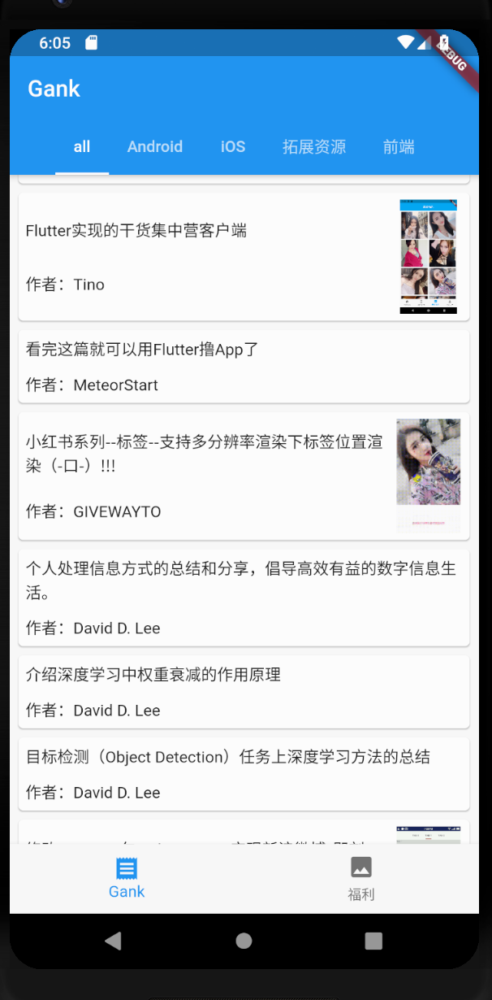
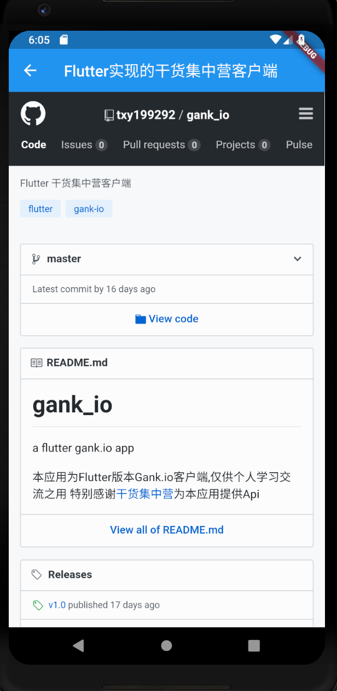

# FlutterGank

初学Flutter，利用gank.io提供的api接口实现了一个Flutter Demo.

主要实践了Flutter的如下几个知识点：
1. 如何使用`dio`框架发起网络请求
2. 如何实现常用布局，如：
    - 水平布局
    - 垂直布局
    - 层叠布局
    - 如何设置间距(padding)
3. 如何显示网络图片
4. 如何使用下拉刷新组件
5. 如何使用`ListView`组件，以及添加上拉加载更多功能
6. 如何给普通`widget`添加事件监听(如点击事件)
7. 在Flutter中如何使用`WebView`
8. 如何创建`Material Design`风格的应用以及自定义其主题样式
9. 如何使用`AppBar`组件同时给其添加`TabBarView`组件和`BottomNavigationBar`
10. 如何进行页面跳转

Demo效果如如下：   

